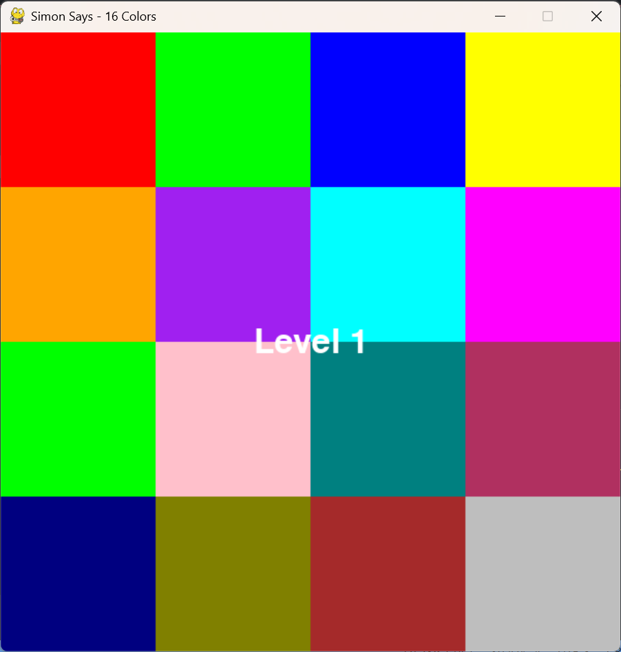

Simon Says – Memory Game with Theme & Music Customization

An interactive and engaging 4x4 grid-based memory game inspired by Simon Says, built using Python and Pygame. Features dynamic themes, background music, level-based milestones, and high score tracking.

---

  Features

- 🎨 Theme Switching: Choose between Dark, Light, Retro, and Neon themes using `Ctrl + T` during gameplay.
- 🎵 Background Music: Plays nostalgic music in a loop for immersive gameplay.
- 🧠 Memory Challenge: The game presents an increasing sequence of 16 colored buttons. Player must repeat it exactly.
- 🏆 Milestone Messages: Celebratory feedback at levels 5, 10, and 20.
- 💾 High Score Persistence: Stores and displays the highest level reached between sessions.
- 🖱️ Mouse and Keyboard Controls: Supports intuitive input with both click and keyboard.

---

 🛠️ Technologies Used

- Python
- Pygame
- File I/O (for high score tracking)
- pygame.mixer for background audio

---

 📦 Requirements

Install dependencies using:

```bash
pip install -r requirements.txt
